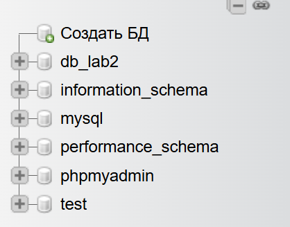
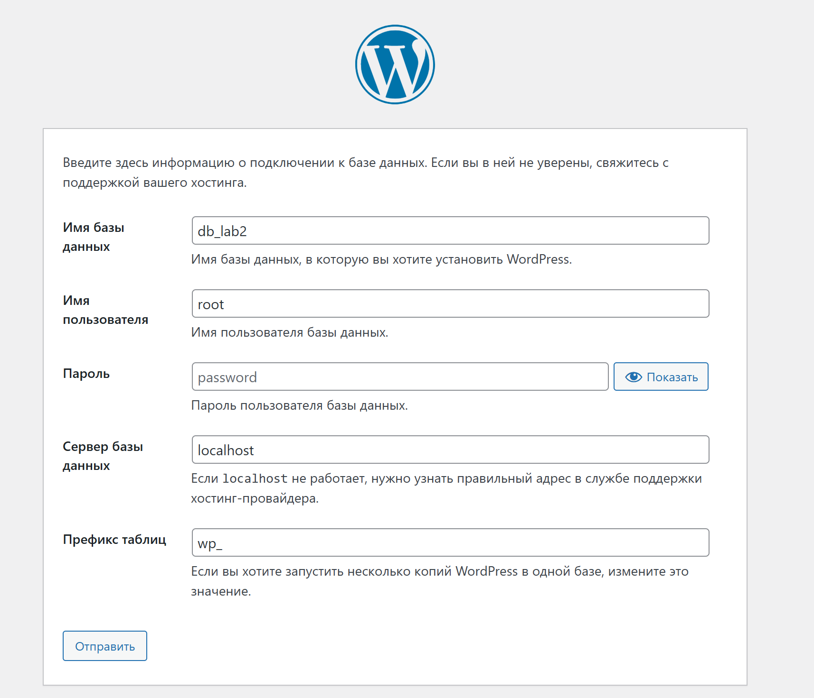
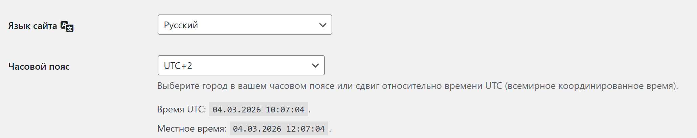
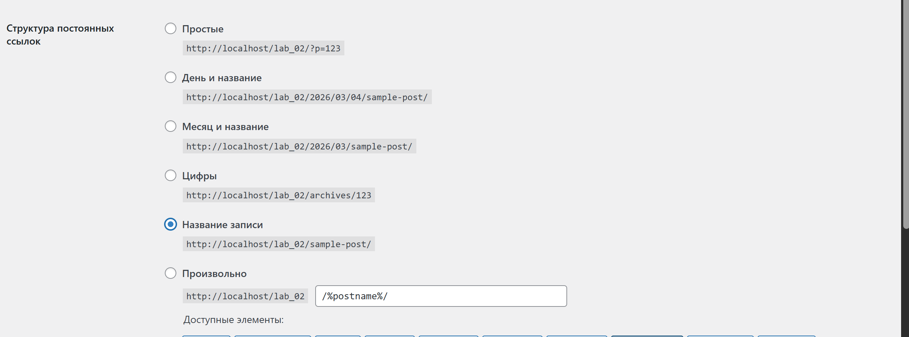
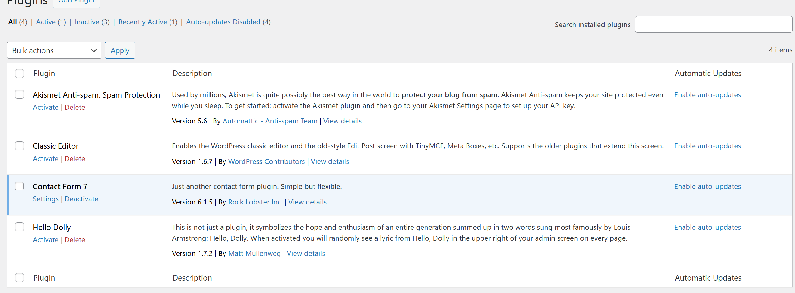
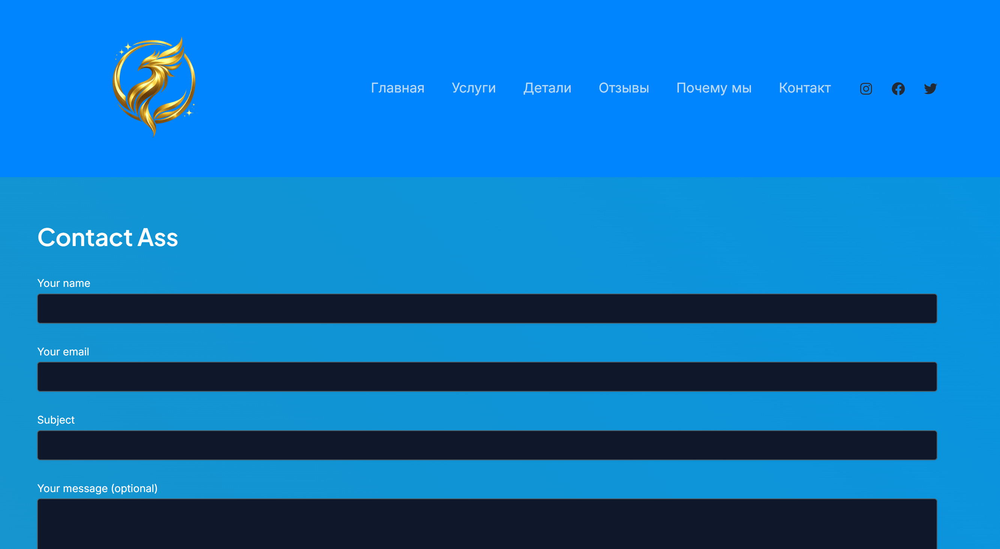
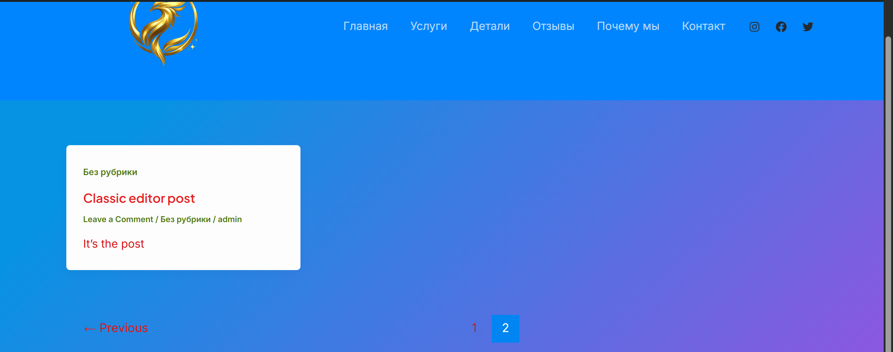
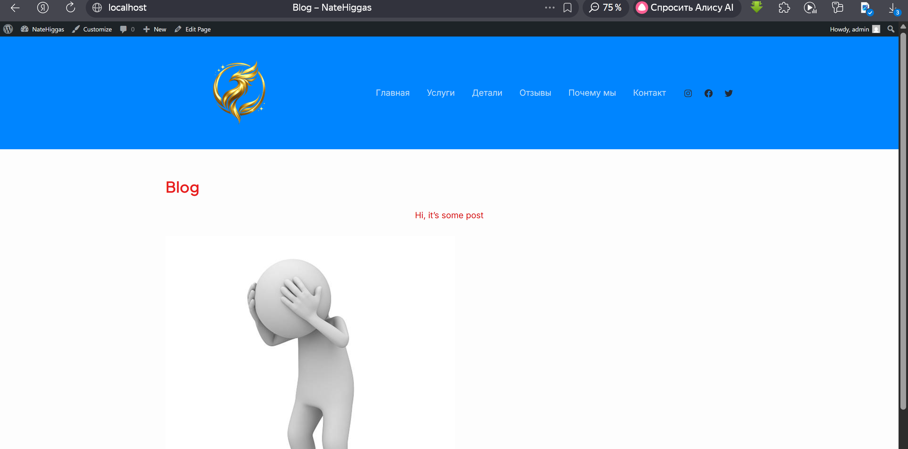

# Лабораторная работа №2

## Цель работы

Научиться устанавливать WordPress в локальной среде, освоить работу с административной панелью, изменять внешний вид сайта с помощью тем и расширять функциональность системы с помощью плагинов.

## Процесс выполения

### Шаг 1. Подготовка среды

Для выполнения лабораторной работы был установлен локальный сервер **XAMPP**, который включает в себя веб-сервер Apache, систему управления базами данных MySQL, интерпретатор PHP и инструмент phpMyAdmin для работы с базами данных.

После установки были запущены модули:

- Apache
- MySQL

Работоспособность сервера была проверена через браузер по адресу: `http://localhost`

После запуска сервера в интерфейсе **phpMyAdmin** была создана новая база данных: `db_lab2`

Эта база данных будет использоваться WordPress для хранения контента сайта (страниц, записей, пользователей, настроек и других данных).

### Шаг 2. Установка WordPress

WordPress был скачан с официального сайта: `https://wordpress.org`

Архив WordPress был распакован в директорию локального сервера: `htdocs/lab_02`

После распаковки установка была запущена через браузер по адресу: `http://localhost/lab_02`

Во время установки были указаны параметры подключения к базе данных и после успешного подключения WordPress автоматически создал необходимые таблицы в базе данных и была создана учетная запись администратора сайта.

### Шаг 3. Первоначальные настройки сайта

После установки WordPress в разделе **Settings → General** были изменены основные параметры сайта:

- название сайта
- описание сайта
- часовой пояс

и установлен вариант структуры ссылок **Post name**: Эти настройки определяют базовую конфигурацию сайта и используются системой при публикации контента и позволяют использовать удобные и читаемые ссылки для страниц и записей сайта Такая структура ссылок является более удобной для пользователей и часто используется на реальных сайтах.

### Шаг 4. Работа с темами

Темы в WordPress отвечают за внешний вид сайта и определяют дизайн страниц, расположение элементов интерфейса и стили оформления.

Из официального каталога WordPress была установлена тема **Astra**.

После установки тема была активирована, что привело к изменению внешнего вида сайта.

Для дополнительной настройки темы был использован раздел `Appearance → Customize`

В данном разделе были изменены следующие параметры сайта:

- логотип сайта
- цветовая схема
- заголовок сайта
- описание сайта

Эти изменения позволяют адаптировать внешний вид сайта без необходимости редактирования кода.

### Шаг 5. Работа с плагинами

Плагины в WordPress используются для расширения функциональности системы и добавления новых возможностей без изменения исходного кода.

Для установки плагинов был открыт раздел **Plugins → Add New**.

Были установлены и активированы следующие плагины:

#### Classic Editor

Плагин `Classic Editor` возвращает классический редактор записей WordPress, который использовался в более ранних версиях системы.  
Он позволяет редактировать записи в привычном текстовом интерфейсе.

С его помощью была создана тестовая запись в блоге.

#### Contact Form 7

Плагин `Contact Form 7` используется для создания форм обратной связи на сайте.

После установки плагина была создана форма обратной связи, для которой WordPress автоматически сгенерировал shortcode.

Этот shortcode был использован для вставки формы на страницу сайта.

После проверки работы плагинов один из них был отключен через раздел **Plugins → Installed Plugins**, чтобы убедиться, что после отключения плагина его функциональность перестает работать.

#### Шаг 6. Создание контента

После настройки темы и установки плагинов был создан основной контент сайта.

### Создание страницы "Контакты"

В разделе **Pages → Add New** была создана страница `Контакты`.

На эту страницу была добавлена форма обратной связи, созданная с помощью плагина `Contact Form 7`.

Таким образом пользователи сайта могут отправлять сообщения через форму обратной связи.

### Создание записей блога

В разделе **Posts → Add New** были созданы несколько записей блога.

Записи содержали различный тип контента:

- текст
- изображения

Для отображения записей была создана отдельная страница `Blog`, на которой отображаются опубликованные записи.

---

## Контрольные вопросы

1. Что делает тема в WordPress, а что — плагин?

    **Тема (Theme)** отвечает за внешний вид сайта.  
    Она определяет дизайн страниц, расположение элементов интерфейса, цветовую схему, шрифты и структуру отображения контента.

    **Плагин (Plugin)** расширяет функциональность WordPress.  
    С помощью плагинов можно добавлять новые возможности, например формы обратной связи, галереи, SEO-инструменты, редакторы страниц и другие функции.

2. Почему при смене темы контент сайта не теряется?

    Контент сайта хранится в базе данных WordPress, а не в файлах темы.

    Тема отвечает только за отображение контента. Поэтому при смене темы меняется внешний вид сайта, но записи, страницы, изображения и пользователи остаются в базе данных и не удаляются.

3. Как можно изменить внешний вид сайта без редактирования кода?

    Изменить внешний вид сайта можно несколькими способами:

    - установив новую тему WordPress;
    - используя настройки темы через **Appearance → Customize**;
    - изменяя логотип, цветовую схему и описание сайта;
    - устанавливая плагины для изменения дизайна;
    - используя визуальные редакторы страниц.

## Вывод

В ходе выполнения лабораторной работы была выполнена установка WordPress в локальной среде с использованием XAMPP. Была создана база данных, выполнена установка системы и произведены базовые настройки сайта.

Также была изучена работа с темами и плагинами WordPress. Была установлена и настроена тема Astra, а также установлены плагины Classic Editor и Contact Form 7.

Дополнительно был создан контент сайта, включая страницу контактов с формой обратной связи и несколько записей блога.

В результате выполнения лабораторной работы были получены практические навыки установки, настройки и использования системы управления контентом WordPress.
