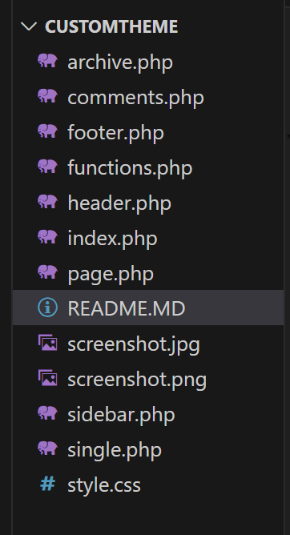
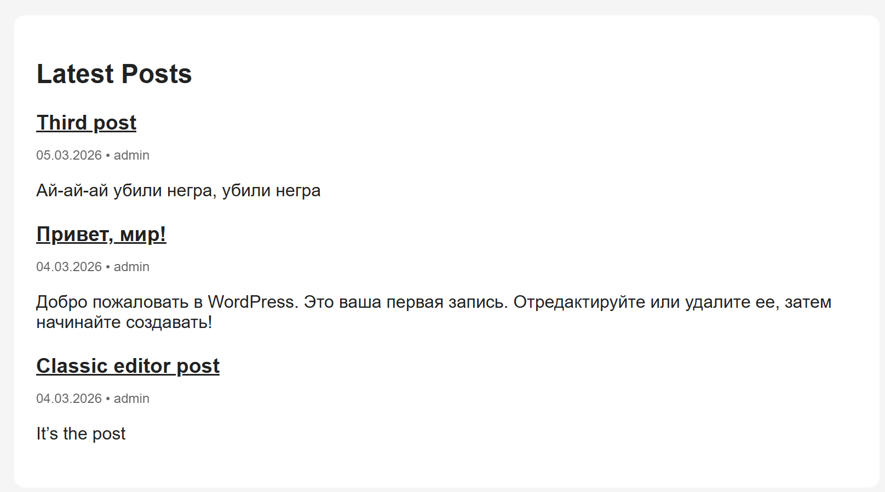
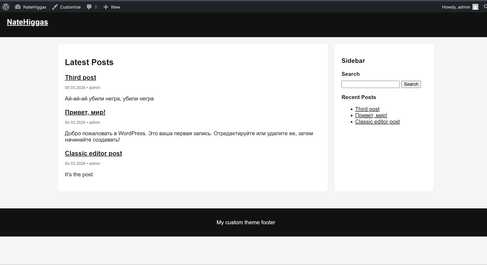
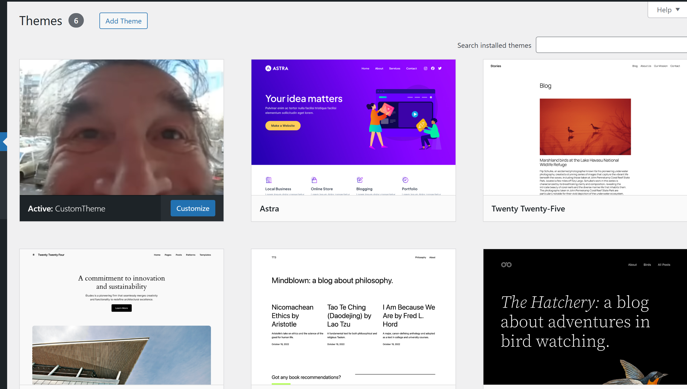

# Лабораторная работа №3: Разработка простой темы WordPress

## Цель работы

Научиться создавать собственную тему WordPress, изучить её минимальную структуру и понять принципы работы шаблонов.

## Процесс выполнения

### Шаг 1. Подготовка среды

В локальной установке WordPress была открыта директория `wp-content/themes`, где хранятся все темы сайта.  
В этой папке была создана новая директория для своей темы — `customtheme`.

Для удобства разработки в файле `wp-config.php` была включена отладка, установив параметр: `define('WP_DEBUG', true);`

Это позволяет выводить возможные ошибки и предупреждения во время разработки темы.

### Шаг 2. Создание обязательных файлов темы

В папке темы были созданы два обязательных файла:

- `style.css`
- `index.php`

Файл `style.css` содержит метаданные темы (название, автор, описание, версия), благодаря которым WordPress распознаёт тему и отображает её в панели администратора. После метаданных были добавлены базовые CSS-стили для оформления сайта.

Файл `index.php` был создан как основной шаблон темы. В него была добавлена базовая HTML-структура страницы, которая используется WordPress для отображения контента сайта.

### Шаг 3. Общие части шаблонов

Для структурирования темы и повторного использования кода были созданы файлы общих частей шаблонов:

- `header.php` — файл шапки сайта  
- `footer.php` — файл подвала сайта  

В файл `header.php` был перенесён код верхней части страницы (doctype, тег `<head>`, подключение стилей через `wp_head()`, начало `<body>` и шапка сайта).

В файл `footer.php` был перенесён код нижней части страницы (подвал сайта и функция `wp_footer()`).

В основном шаблоне `index.php` эти части были подключены с помощью функций WordPress:

- `get_header()` — подключает файл `header.php`
- `get_footer()` — подключает файл `footer.php`

Также в `index.php` был реализован стандартный цикл WordPress (WordPress Loop), который выводит последние записи блога. Для отображения на главной странице был настроен вывод последних 5 записей.

### Шаг 4. Файл функций

В папке темы был создан файл `functions.php`, который используется для добавления функциональности темы.

В данном файле была добавлена функция подключения стилей темы с использованием механизма WordPress `wp_enqueue_style()`. Этот способ является стандартным и позволяет корректно подключать CSS-файлы в теме.

Стили из файла `style.css` были подключены с помощью следующего хука:

`add_action('wp_enqueue_scripts', ...)`

Это позволяет WordPress автоматически подключать стили при загрузке страницы сайта.

### Шаг 5. Дополнительные шаблоны

Для более гибкого отображения различных типов контента в теме были созданы дополнительные шаблоны:

- `single.php` — используется для отображения отдельной записи блога  
- `page.php` — используется для отображения страниц сайта  
- `sidebar.php` — файл боковой панели  
- `comments.php` — шаблон отображения комментариев  
- `archive.php` — шаблон архивов записей  

Файл `sidebar.php` был подключён в шаблоны с помощью функции `get_sidebar()`.  
Файл `comments.php` был подключён в шаблонах `single.php` и `page.php`, что позволяет отображать список комментариев и форму добавления комментария под записью или страницей.

Такая структура позволяет WordPress автоматически выбирать нужный шаблон в зависимости от типа отображаемого контента.

### Шаг 6. Стилизация темы

После создания структуры шаблонов были добавлены стили оформления сайта в файл `style.css`.

Были оформлены основные элементы страницы:

- шапка сайта (header)
- подвал (footer)
- основной контент
- боковая панель
- записи и страницы

Для удобства верстки использовалась контейнерная структура с разделением области контента и боковой панели.  
Стили позволили сделать базовое визуальное оформление темы и улучшить читаемость контента на странице.

### Шаг 7. Скриншот темы

В папку темы был добавлен файл `screenshot.png`.  
Этот файл используется WordPress как изображение-превью темы в панели администратора.

Изображение было подготовлено размером **1200×900 px** и помещено в корневую директорию темы.  
После добавления файла превью темы стало отображаться в разделе выбора тем.

### Шаг 8. Активация темы

После завершения разработки базовой структуры темы она была активирована в админ-панели WordPress.

Для этого был открыт раздел **Appearance → Themes**, где среди доступных тем появилась созданная тема `CustomTheme`. После активации темы сайт начал отображаться с использованием разработанных шаблонов и стилей.

Была проверена корректность отображения основных элементов сайта: шапки, контента, боковой панели и подвала. Также были проверены страницы записей и архивов, чтобы убедиться, что соответствующие шаблоны работают правильно.

## Инструкции по запуску проекта

1. Установить локальный веб-сервер **XAMPP**.
2. Запустить модули **Apache** и **MySQL**.
3. Открыть папку установки WordPress и перейти в директорию: `wp-content/themes`
4. Скопировать папку темы `customtheme` в данную директорию.
5. Открыть административную панель WordPress: `http://localhost/lab_02/wp-admin`
6. Перейти в раздел **Appearance → Themes**.
7. Найти тему **CustomTheme** и активировать её.

После активации тема будет применена к сайту.

## Краткая документация к теме

Разработанная тема имеет минимальную структуру и демонстрирует базовые принципы работы тем WordPress.

### Основные файлы темы

`style.css`     | содержит метаданные темы и стили оформления |
`index.php`     | основной шаблон для отображения записей |
`header.php`    | шаблон шапки сайта |
`footer.php`    | шаблон подвала сайта |
`sidebar.php`   | шаблон боковой панели |
`single.php`    | шаблон отображения отдельной записи |
`page.php`      | шаблон отображения страниц |
`archive.php`   | шаблон архивов записей |
`comments.php`  | отображение комментариев |
`functions.php` | подключение стилей и дополнительной функциональности |

## Примеры использования темы

Тема предназначена для отображения блога WordPress и поддерживает основные типы страниц.

### Главная страница

На главной странице отображается список последних записей блога с использованием стандартного цикла WordPress.

### Страница записи

При открытии отдельной записи используется шаблон `single.php`, который отображает полный текст записи и блок комментариев.

### Статические страницы

Для отображения обычных страниц используется шаблон `page.php`.

### Боковая панель

Боковая панель выводится с помощью шаблона `sidebar.php` и может содержать дополнительные элементы интерфейса, например список последних записей или форму поиска.

## Использованные источники

1. WordPress Developer Resources  
   `https://developer.wordpress.org/`

2. WordPress Theme Handbook  
   `https://developer.wordpress.org/themes/`

3. WordPress Official Website  
   `https://wordpress.org/`

4. WordPress Codex Documentation  
   `https://codex.wordpress.org/`

## Контрольные вопросы

1. Какие два файла являются обязательными для любой темы WordPress?
    Для любой темы WordPress обязательными являются файлы **style.css** и **index.php**.  
    Файл `style.css` содержит метаданные темы и её стили, а `index.php` является основным шаблоном, который используется для отображения страниц сайта, если отсутствуют более специализированные шаблоны.

2. Как подключаются общие части шаблонов (header, footer, sidebar)?
    Общие части шаблонов подключаются с помощью специальных функций WordPress:

    - `get_header()` — подключает файл `header.php`
    - `get_footer()` — подключает файл `footer.php`
    - `get_sidebar()` — подключает файл `sidebar.php`

    Это позволяет использовать одну и ту же структуру шапки, подвала и боковой панели на разных страницах сайта.

3. Чем отличаются index.php, single.php и page.php?

    `index.php` — основной шаблон темы. Он используется WordPress по умолчанию для отображения страниц, если не найден более подходящий шаблон.

    `single.php` — используется для отображения отдельной записи блога.

    `page.php` — используется для отображения статических страниц сайта.

4. Зачем нужен файл functions.php в теме?
    Файл `functions.php` используется для добавления дополнительной функциональности темы.  
    В нём можно подключать стили и скрипты, регистрировать меню и виджеты, добавлять поддержку различных возможностей WordPress и расширять поведение темы.
