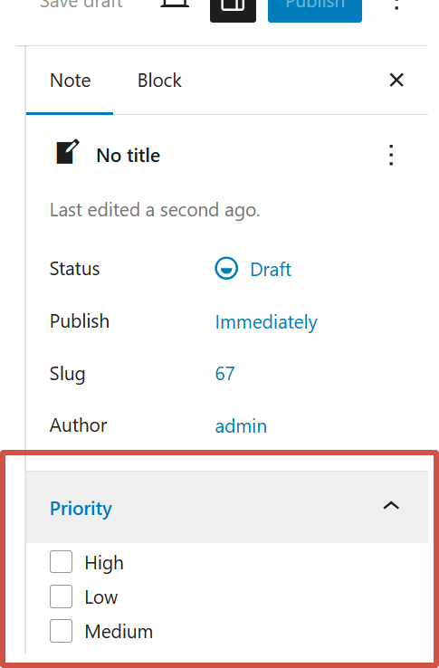
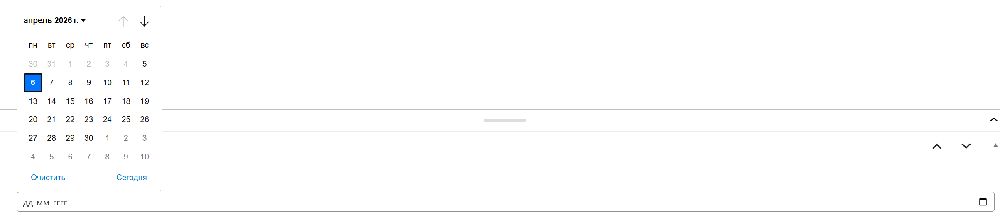
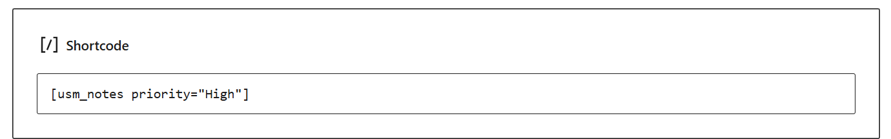
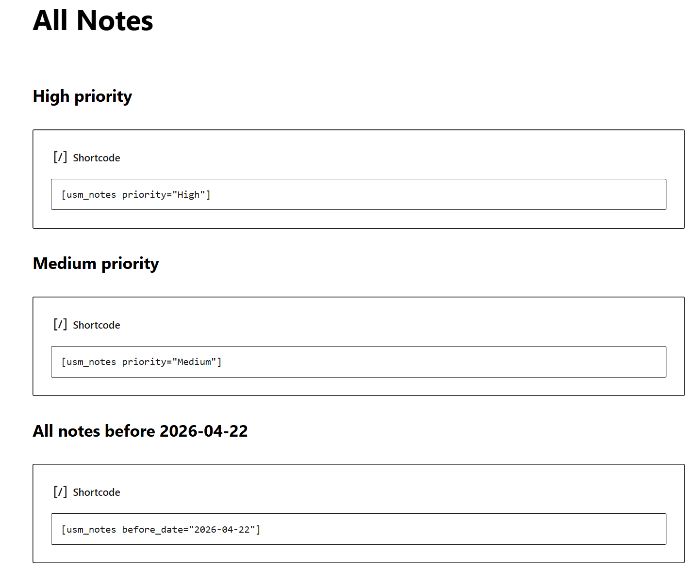
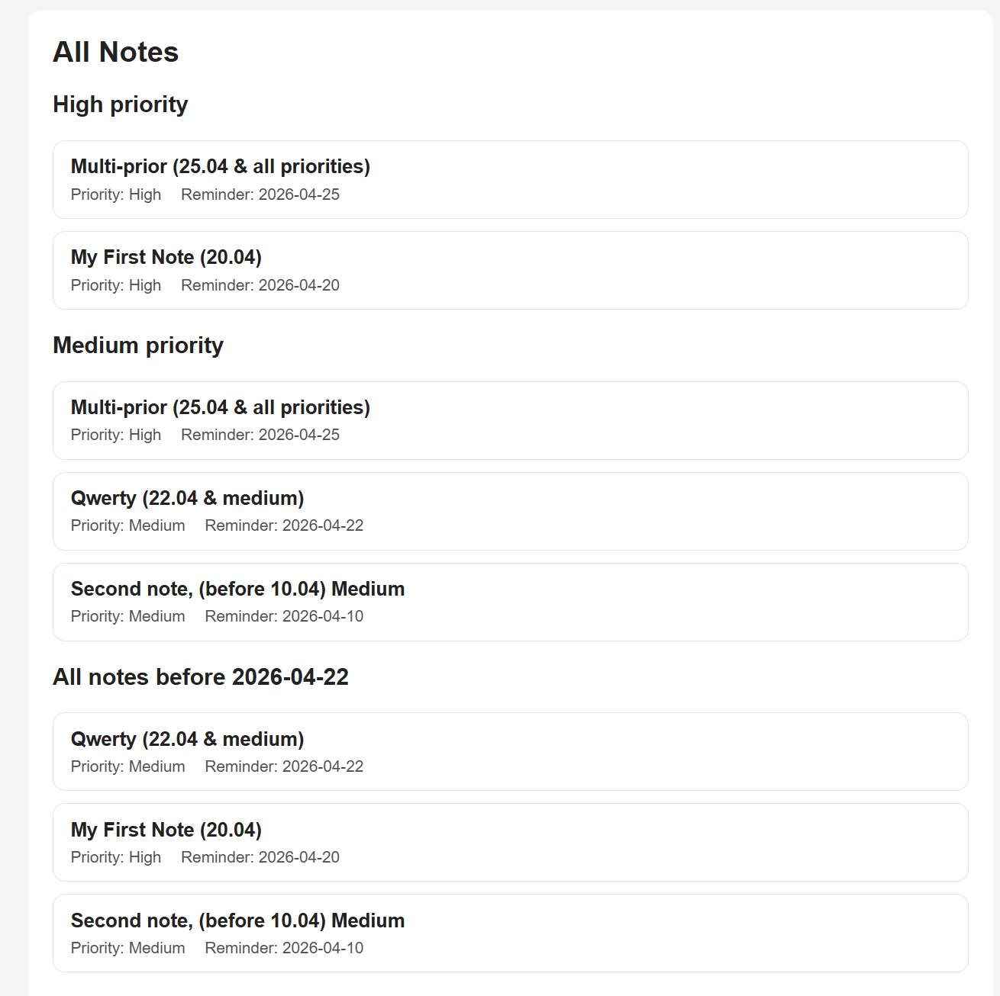

# Лабораторная работа №4. Разработка плагина WordPress (USM Notes)

## Описание лабораторной работы

Целью работы является освоение расширяемой модели данных WordPress. В рамках лабораторной был разработан пользовательский плагин **USM Notes**, который добавляет на сайт новый тип записей — «Заметки» с дополнительными возможностями:

- назначение приоритета (High / Medium / Low);
- установка даты напоминания;
- фильтрация заметок через шорткод.

1. Был создан плагин `usm-notes` с основным файлом `usm-notes.php`, содержащим метаданные (название, описание, версия, автор).  
    Плагин успешно активирован через админ-панель WordPress.

2. Реализация Custom Post Type (Notes)
    С помощью функции `register_post_type()` был создан новый тип записей — **Notes**.

    Реализованы:

    - публичность и доступность на фронтенде;
    - поддержка заголовка, контента, автора и миниатюры;
    - архивная страница;
    - пользовательские метки и иконка в админке.

    После регистрации в админ-панели появился отдельный раздел для управления заметками.

    

3. Добавление таксономии Priority
    Создана пользовательская таксономия **Priority** через `register_taxonomy()` и связана с CPT Notes.

    Особенности:

    - иерархическая структура (как категории);
    - значения: High, Medium, Low;
    - используется для классификации заметок по важности.
    

4. Реализация метабокса (Reminder Date)
    Добавлен метабокс с полем выбора даты (`input type="date"`).

    Реализовано:

    - сохранение значения через `save_post`;
    - проверка безопасности (nonce);
    - обязательность заполнения;
    - валидация (запрет на выбор даты в прошлом).

    Дата также выведена в списке заметок в админке.

    

5. Реализация шорткода
    Создан шорткод `[usm_notes]`

    Поддерживаются параметры:

    - `priority` — фильтрация по приоритету;
    - `before_date` — фильтрация по дате.

    Шорткод выполняет:

    - выборку заметок через `WP_Query`;
    - применение фильтров;
    - вывод списка заметок на странице.
    (Больше скринов с демонстрацией будут ниже)
    

6. Тестирование (продемонстрировано более детально в ниже)
    Создано несколько заметок с различными приоритетами и датами.  
    Проверена работа:
    - отображения всех заметок;
    - фильтрации по приоритету;
    - фильтрации по дате.
    

## Инструкции по запуску проекта

1. Установить и запустить локальный сервер (например, XAMPP).
2. Убедиться, что модули Apache и MySQL запущены.
3. Открыть проект WordPress в браузере: `http://localhost/lab_02`
4. Перейти в директорию плагинов: `wp-content/plugins/`
5. Убедиться, что папка плагина присутствует: `usm-notes`
6. В админ-панели WordPress перейти в: `Plugins → Installed Plugins`
7. Активировать плагин **USM Notes**.
8. После активации в админ-панели появляется новый раздел: `Notes (Заметки)`

## Краткая документация к плагину

Плагин **USM Notes** добавляет новую сущность в WordPress — заметки, реализованную через Custom Post Type.

### 1. Custom Post Type (Notes)

Создаётся новый тип записей:

1. название: Notes (Заметки);
2. поддержка:
    - заголовка;
    - контента;
    - автора;
    - миниатюры;
3. доступен в админ-панели;
4. имеет собственную архивную страницу.

### 2. Таксономия "Приоритет"

Для заметок добавлена пользовательская таксономия:

1. название: Priority (Приоритет);
2. тип: иерархическая (как категории);
3. возможные значения:
    - High
    - Medium
    - Low

Таксономия позволяет классифицировать заметки по важности.

### 3. Метабокс "Дата напоминания"

В редакторе заметок добавлено дополнительное поле:

- тип: дата (`input type="date"`);
- обязательное для заполнения;
- сохраняется как метаданные записи.

Особенности:

- выполняется проверка безопасности (nonce);
- дата не может быть в прошлом;
- значение сохраняется и отображается при редактировании.

## Примеры использования плагина

Плагин использует шорткод для вывода заметок на страницах сайта.

### 1. Отображение всех заметок

 `[usm_notes]`

### 2. Фильтрация по приоритету

`[usm_notes priority="high"]`

### 3. Фильтрация по дате

`[usm_notes before_date="2026-04-30"]`

## Ответы на контрольные вопросы

### 1. Чем пользовательская таксономия отличается от метаполя?

Пользовательская таксономия и метаполе решают разные задачи:

**Таксономия** — это способ *группировки и классификации* записей.  
Пример: приоритет (High / Medium / Low), категории, теги.

**Метаполе** — это *дополнительное свойство одной конкретной записи*.  
Пример: дата напоминания, цена товара, количество.

Основное отличие:

- таксономия — используется для **фильтрации и организации данных** если нужно группировать записи (например, приоритеты, категории);
- метаполе — используется для **хранения дополнительной информации** если нужно хранить уникальное значение (например, дата, число, статус).

### 2. Зачем нужен nonce при сохранении метаполей?

**Nonce** — это специальный одноразовый токен безопасности, который защищает формы от подделки запросов (CSRF-атак).

Зачем он нужен:

- проверяет, что запрос действительно отправлен с сайта, а не извне;
- защищает данные от несанкционированного изменения.

Что будет, если не проверять nonce:

- злоумышленник может отправить POST-запрос на сервер;
- метаданные могут быть изменены без ведома пользователя;
- возможна компрометация данных сайта.

Таким образом, проверка nonce является обязательной частью безопасной работы с формами в WordPress.

### 3. Какие аргументы register_post_type() и register_taxonomy() важны для фронтенда и UX?

Наиболее важные параметры:

#### 1. public

Определяет, доступен ли тип записи или таксономия на сайте (фронтенде).

Почему важно:

- если false — записи не будут отображаться пользователям;
- влияет на видимость контента.

#### 2. has_archive

Включает архивную страницу для CPT.

Почему важно:

- позволяет вывести список всех записей;
- удобно для навигации пользователей (например, страница всех заметок).

#### 3. supports

Определяет, какие поля доступны при создании записи:

- title
- editor
- thumbnail и др.

Почему важно:

- влияет на удобство редактирования;
- определяет функциональность записи.

#### 4. hierarchical (для таксономий)

Определяет, будет ли таксономия иерархической (как категории).

Почему важно:

- позволяет создавать структуру (родитель → дочерние элементы);
- удобно для сложной классификации.

#### 5. labels

Задаёт названия элементов в админке.

Почему важно:

- влияет на удобство использования (UX);
- делает интерфейс понятным для пользователя.

#### 6. show_in_rest

Включает поддержку REST API и редактора Gutenberg.

Почему важно:

- необходимо для работы современного редактора;
- влияет на совместимость с блоками.

## Список использованных источников

1. WordPress Developer Resources — Plugins documentation  
`https://developer.wordpress.org/plugins/`

2. Официальный сайт WordPress  
`https://wordpress.org/`

3. Документация по безопасности WordPress (Nonces)  
`https://developer.wordpress.org/apis/security/nonces/`

4. Учебное руководство по wordpress:
`https://elearning.usm.md/course/view.php?id=7868`
