# Лабораторная работа №5  

## Тема: Безопасность WordPress  

## 1. Цель работы  

Закрепить практические навыки обеспечения безопасности WordPress, включая управление доступом, настройку обновлений и базовое усиление защиты системы (hardening).

## 2. Задачи работы

- Изучить управление пользователями и ролями  
- Настроить безопасные параметры WordPress  
- Выполнить обновление системы  
- Реализовать базовые меры защиты  

## 3. Описание выполненных шагов  

### 3.1 Подготовка среды

Был выполнен вход в административную панель WordPress с правами администратора.  
Для отладки системы в файл wp-config.php была добавлена строка:

define('WP_DEBUG', true);

Это позволило включить режим отображения ошибок для диагностики системы.

### 3.2 Управление пользователями и паролями

Был создан тестовый пользователь с ролью "Автор" для проверки разграничения прав доступа.  

Также была выполнена проверка учетных записей администраторов. Для всех пользователей установлены сложные пароли, содержащие не менее 8 символов, включая буквы, цифры и специальные символы.  

Данная мера направлена на снижение риска подбора пароля (brute force атак).

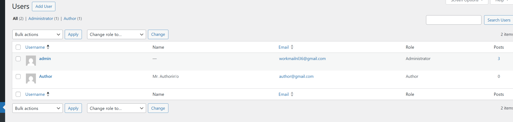

### 3.3 Обновление WordPress  

Была выполнена проверка наличия обновлений системы.  

Среди компонентов были обновлены только темы, так как остальные были up-to-date.
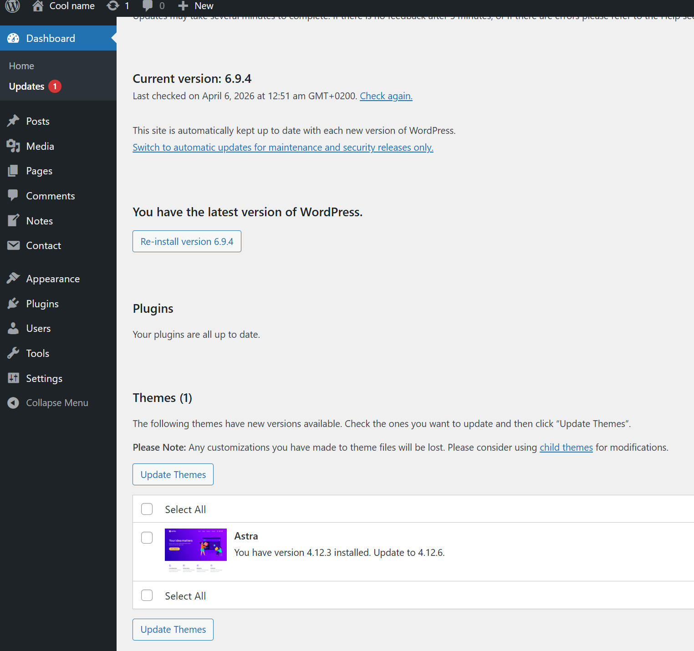

Дополнительно были включены автоматические обновления для плагинов и тем.
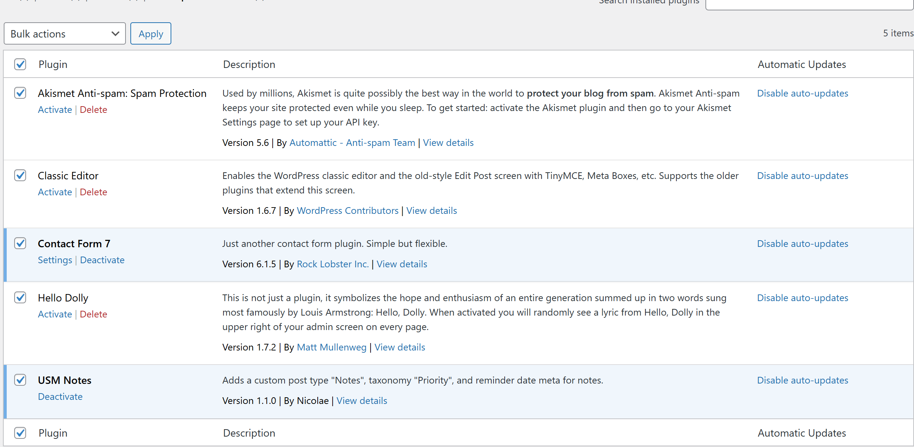

После обновления проведена проверка работоспособности сайта — ошибок и сбоев обнаружено не было.

### 3.4 Базовое hardening  

Для повышения безопасности системы были выполнены следующие действия:

1. Отключено редактирование файлов из административной панели.  
В файл wp-config.php добавлена строка:

define('DISALLOW_FILE_EDIT', true);
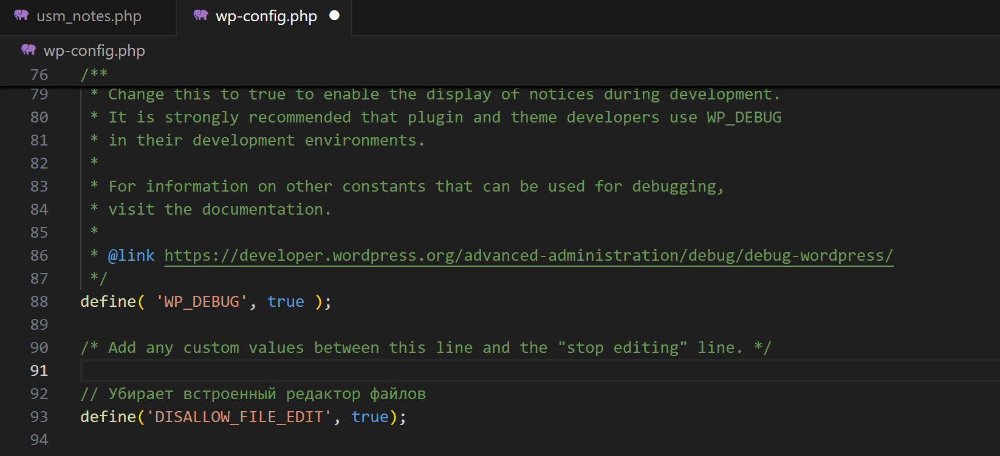

Это предотвращает возможность внедрения вредоносного кода через админ-панель.
2. Ограничен доступ к файлу конфигурации wp-config.php.  
    В файл .htaccess добавлено правило:

``` bash
    <files wp-config.php>
    order allow,deny
    deny from all
    </files>
```

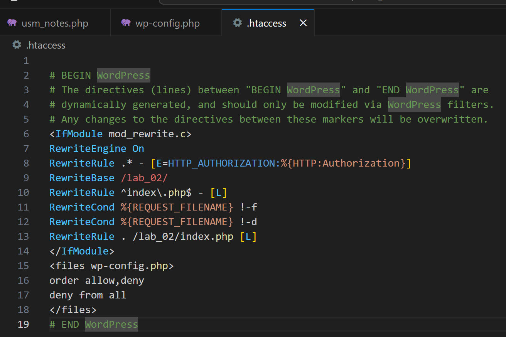
Данная мера защищает конфиденциальные данные (например, доступ к базе данных) от внешнего доступа.

### 3.5 Настройка All In One WP Security & Firewall  

Для повышения уровня защиты веб-приложения был установлен и настроен плагин All In One WP Security & Firewall (AIOS).

Были выполнены следующие настройки:

1. Защита входа в систему (User Login)
    Активирована функция Login Lockdown со следующими параметрами:  
    - максимальное количество попыток входа: 5  
    - период повторных попыток: 15 минут  
    - время блокировки: 30 минут  

    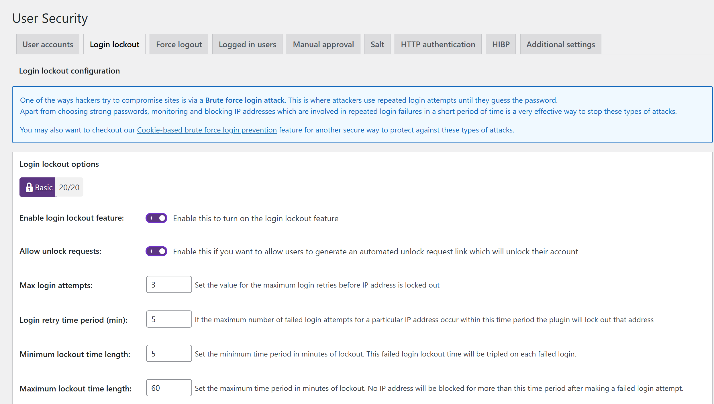

    Также включена функция принудительного выхода пользователей (Force Logout) через 24 часа.  
    Это позволяет ограничить длительность пользовательских сессий и снизить риск несанкционированного доступа.

    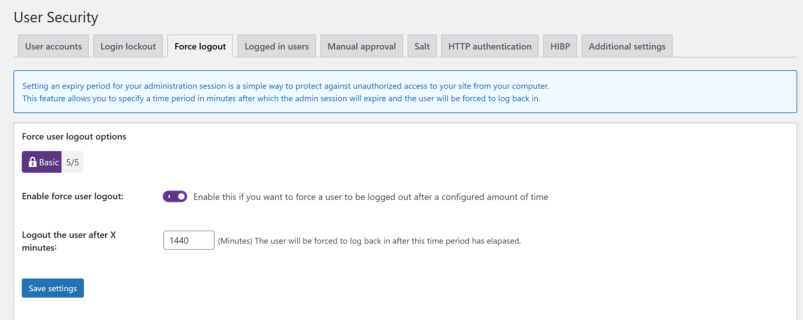

2. Управление учетными записями (User Accounts)  
    Проверено наличие стандартного пользователя с логином "admin".  
    При обнаружении данный логин был заменен на более безопасный.  

    Это уменьшает вероятность успешного подбора учетных данных злоумышленниками.

    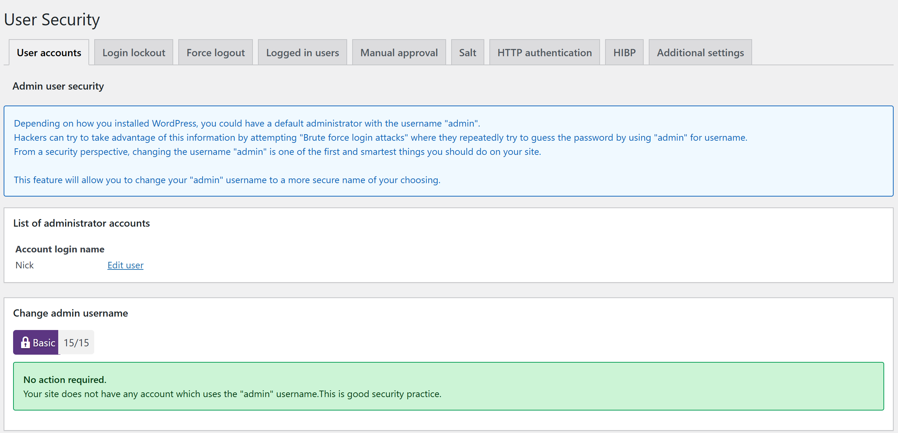

3. Контроль регистрации пользователей (User Registration)  
    Отключена автоматическая регистрация пользователей либо включено ручное подтверждение учетных записей.  

    Это предотвращает массовое создание фейковых аккаунтов.

    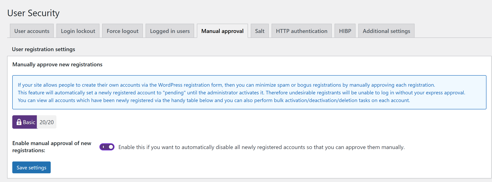

4. Настройка межсетевого экрана (Firewall)  
    Активированы базовые правила защиты (Basic Firewall).  

    Дополнительно включены:

    - защита от вредоносных запросов (Bad Query Strings)  
    - базовая защита от XSS-атак  
    - отключение просмотра содержимого директорий  

    Это обеспечивает фильтрацию входящего трафика и защиту от распространённых атак.

    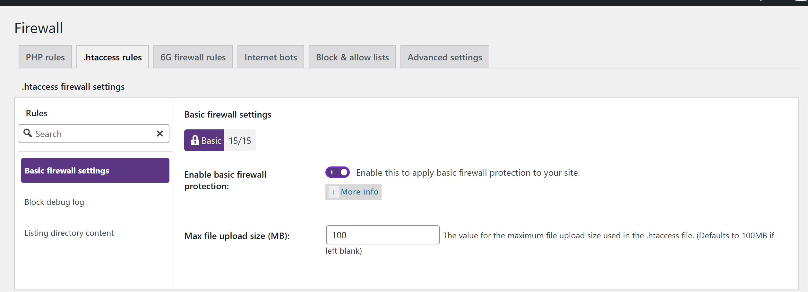
    

5. Защита от brute force атак  

    Изменён стандартный URL страницы входа (/wp-login.php) на нестандартный адрес.  

    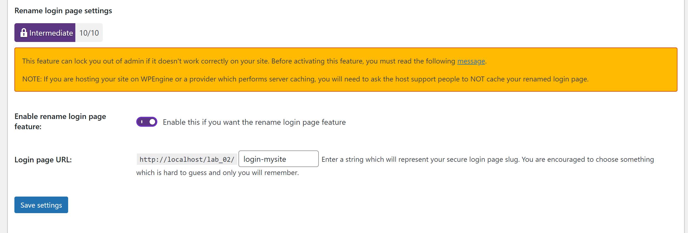

    Это усложняет автоматизированные атаки на страницу авторизации.

6. Мониторинг изменений файлов (Scanner)  
    Активирована функция отслеживания изменений файлов.  
    Настроены уведомления по электронной почте при обнаружении изменений.  

    Это позволяет своевременно выявлять возможные попытки внедрения вредоносного кода.

    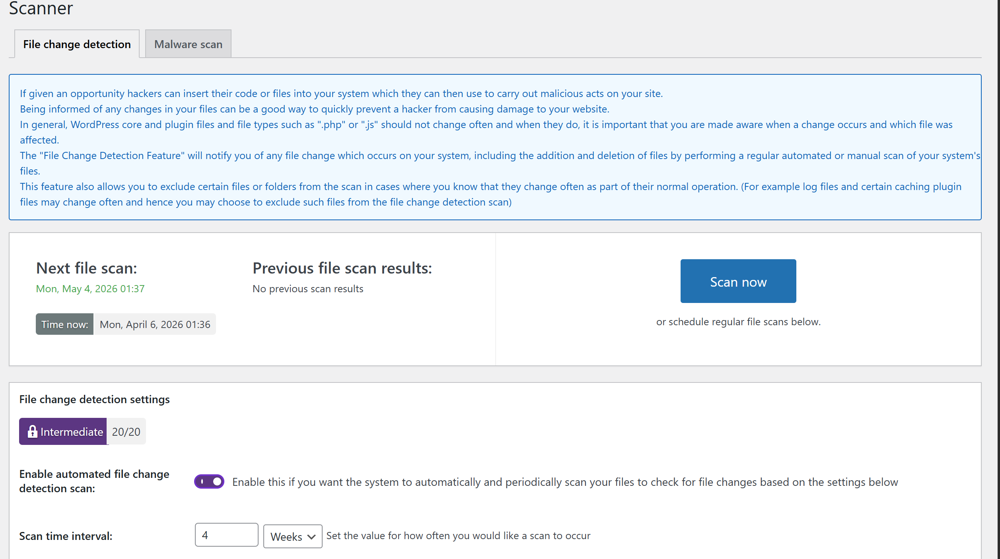

7. Резервное копирование (Backup)  
    Создана резервная копия базы данных.  

    Резервные копии используются для восстановления системы в случае сбоев или атак.

    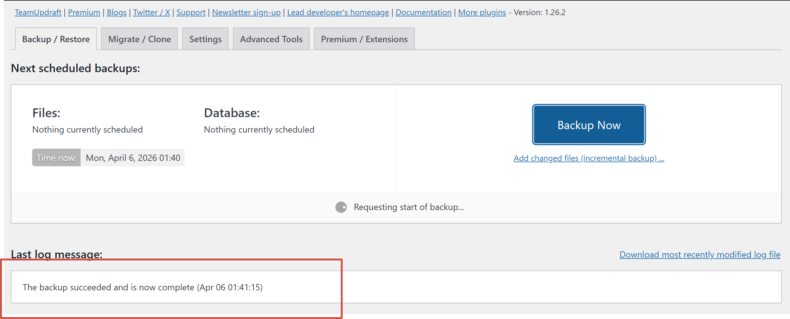

8. Система уведомлений (Notifications)  
    Настроены уведомления о критических событиях, включая:  
    - блокировку пользователей  
    - изменение файлов  
    - создание новых учетных записей с повышенными правами  

    Это обеспечивает оперативное реагирование на потенциальные угрозы.
    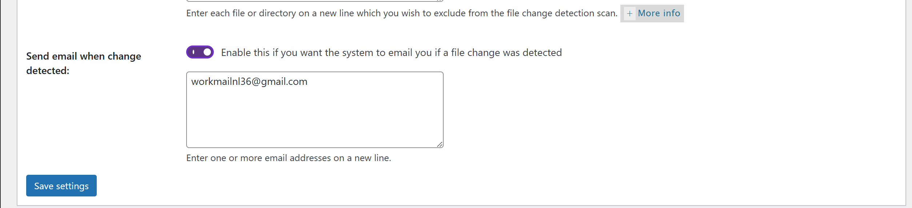

### 3.6 Проверка защиты от brute force атак  

Для проверки корректности настроек защиты была выполнена имитация атаки перебора пароля.

Были выполнены следующие действия:

- выполнен выход из административной панели  
- осуществлен переход на изменённый URL страницы входа  
- произведено 5–6 попыток входа с использованием неверного пароля  

В результате сработал механизм Login Lockdown:

- доступ к учетной записи был временно заблокирован  
- дальнейшие попытки входа стали невозможны

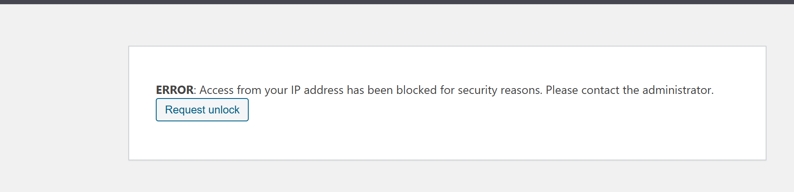

Информация о блокировке была зафиксирована в журнале событий плагина (WP Security → Logs).

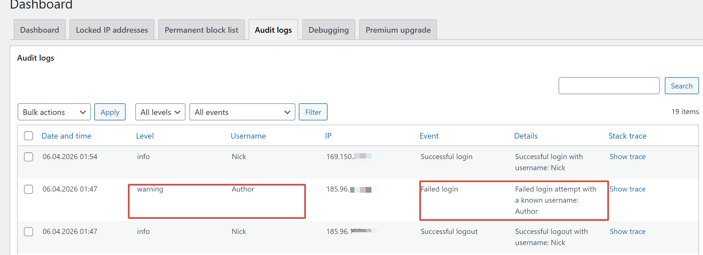

Тестовый IP-адрес был разблокирован через интерфейс плагина.

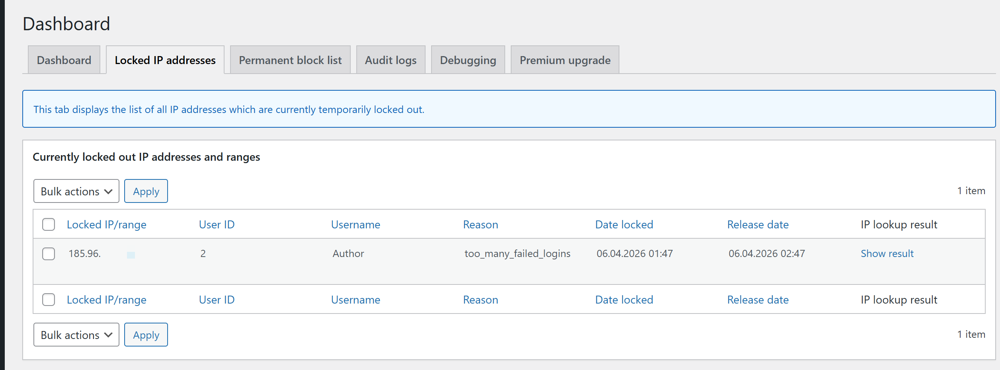

Данный тест подтвердил корректную работу защиты от атак перебора паролей.

### 3.7 Восстановление из резервной копии  

Для проверки работоспособности механизма резервного копирования и восстановления была удалена отдельная страница `Blog`, содеражащая текстовые поля и изображения

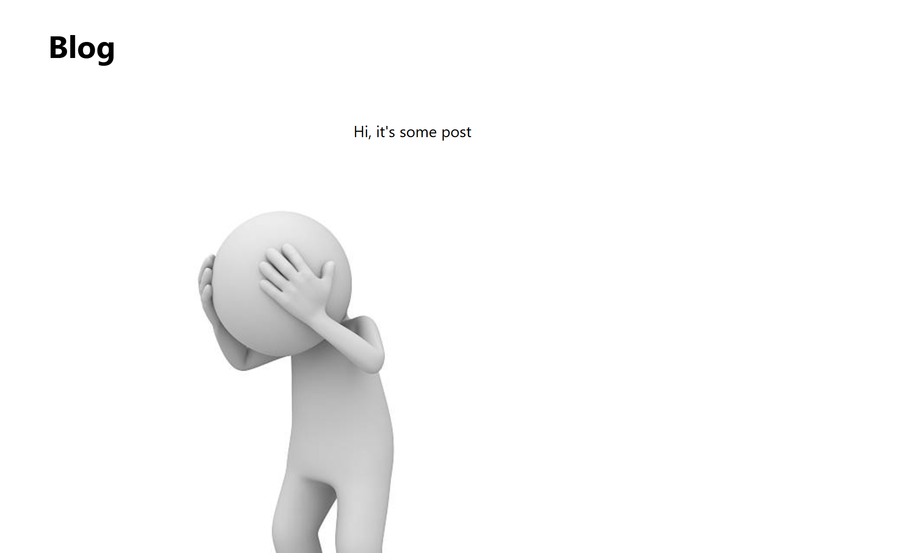

После этого было выполнено восстановление базы данных из ранее созданной резервной копии (путём импорта SQL-файла).

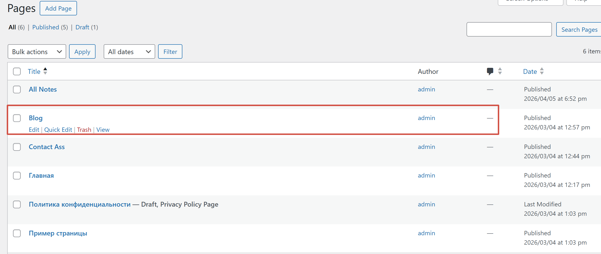

В результате восстановления:

- удалённая запись была успешно восстановлена  
- структура базы данных возвращена в исходное состояние  

Проверка показала, что механизм резервного копирования функционирует корректно и позволяет восстановить данные после их удаления или повреждения.

## 4. Ответы на контрольные вопросы  

1. Почему DISALLOW_FILE_EDIT и правильные права на wp-config.php существенно уменьшают риск пост-эксплойта?  
    Отключение редактирования файлов (DISALLOW_FILE_EDIT) предотвращает возможность изменения файлов тем и плагинов через административную панель. Даже в случае компрометации учетной записи администратора злоумышленник не сможет напрямую внедрить вредоносный код через встроенный редактор.  

    Правильные права доступа к wp-config.php ограничивают возможность его изменения и чтения посторонними пользователями. Данный файл содержит критически важные данные (учетные данные базы данных, ключи безопасности), поэтому его защита существенно снижает риск дальнейшего развития атаки после первоначального взлома (post-exploit).  

2. Какие параметры Login Lockdown/Firewall вы выбрали и почему именно такие (обоснуйте баланс безопасности и UX)?  
    Для защиты от brute force атак были выбраны следующие параметры Login Lockdown:  
    - 5 попыток входа  
    - период повторных попыток — 15 минут  
    - блокировка — 30 минут  

    Данные значения обеспечивают баланс между безопасностью и удобством пользователей. С одной стороны, они эффективно ограничивают автоматические атаки перебора паролей, с другой — не создают чрезмерных неудобств для легитимных пользователей, которые могут ошибиться при вводе пароля.  

    В разделе Firewall был активирован базовый уровень защиты, включая фильтрацию вредоносных запросов и базовую защиту от XSS. Такой подход минимизирует риск ложных срабатываний и не нарушает работу сайта, что особенно важно для стабильности системы.  

3. Чем отличаются меры защиты на уровне WordPress (плагин/WAF) от мер на уровне веб-сервера и ОС?  

    Меры защиты на уровне WordPress (например, плагины безопасности и WAF) работают внутри приложения и направлены на защиту логики сайта: авторизация, обработка запросов, защита от XSS и brute force атак.  

    Защита на уровне веб-сервера (например, .htaccess или конфигурация сервера) контролирует доступ к файлам и обработку HTTP-запросов до их попадания в WordPress.  

    На уровне операционной системы обеспечивается защита самой среды выполнения: права доступа, изоляция процессов, сетевые ограничения.  

    Таким образом, безопасность реализуется на нескольких уровнях, и каждый из них дополняет друг друга.  

4. Что обязательно включать в "полный" бэкап WordPress и как вы проверяете, что восстановление действительно работает?  

    Полный резервный бэкап WordPress должен включать:  

    - базу данных (все записи, пользователи, настройки)  
    - директорию wp-content (темы, плагины, загруженные файлы)  
    - конфигурационные файлы (например, wp-config.php)  

    Для проверки корректности восстановления необходимо выполнить тестовое восстановление:  

    - удалить часть данных (например, запись или файл)  
    - восстановить систему из резервной копии  
    - убедиться, что удаленные данные были полностью восстановлены  

    Также важно проверить работоспособность сайта после восстановления (отсутствие ошибок и корректное отображение контента).

## 5. Вывод  

В ходе выполнения лабораторной работы были изучены и применены основные методы обеспечения безопасности WordPress.  

Были реализованы меры по защите учетных записей, настроены безопасные права доступа к файлам, выполнено обновление системы, а также проведено базовое усиление защиты (hardening).  

С использованием плагина All In One WP Security & Firewall была настроена защита от распространённых атак, включая brute force и XSS, а также реализован мониторинг состояния системы.  

Дополнительно была проверена работоспособность механизмов защиты и восстановления данных, что подтвердило их эффективность.  

Полученные знания и навыки позволяют повысить уровень безопасности веб-приложений на базе WordPress и снизить риски их компрометации.
